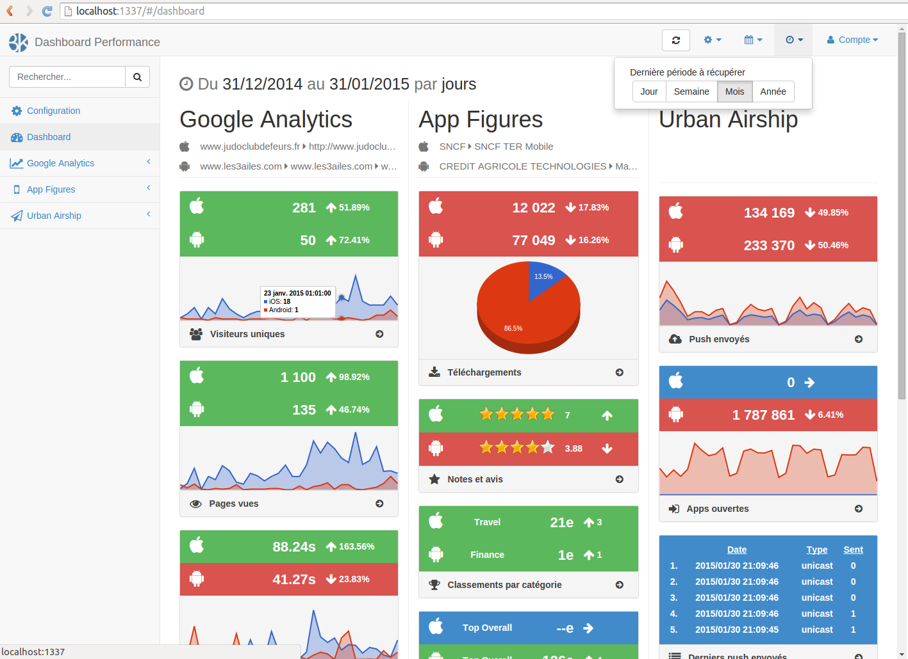
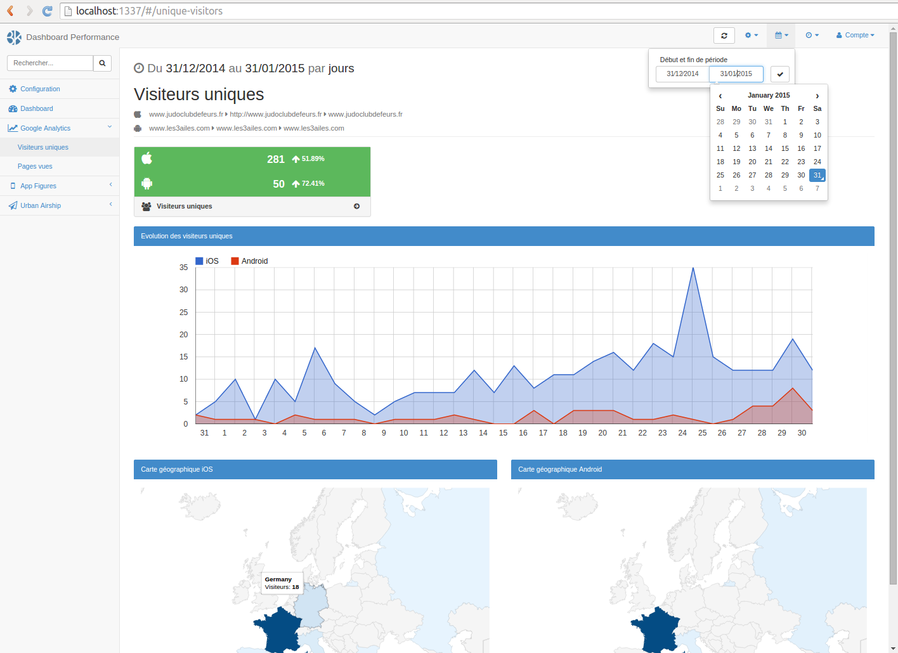
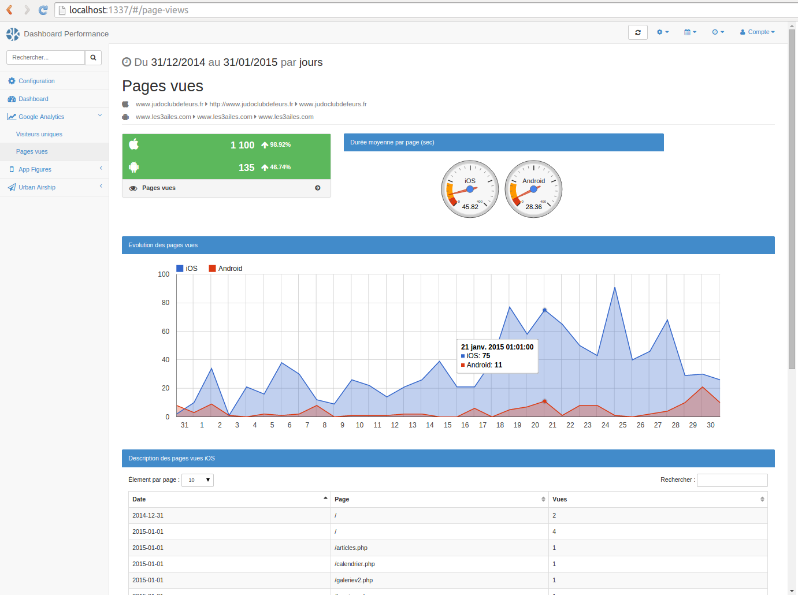
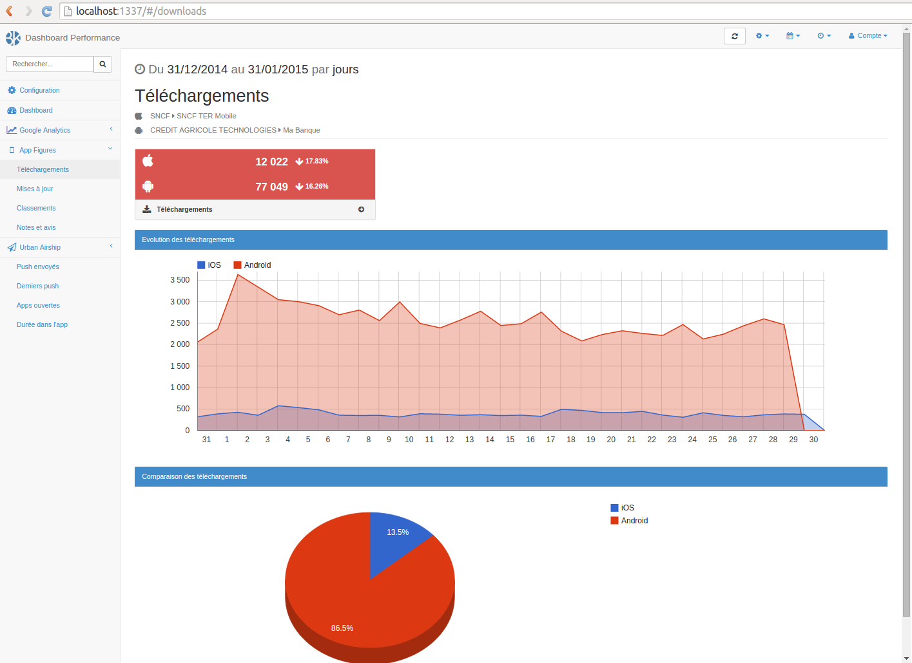
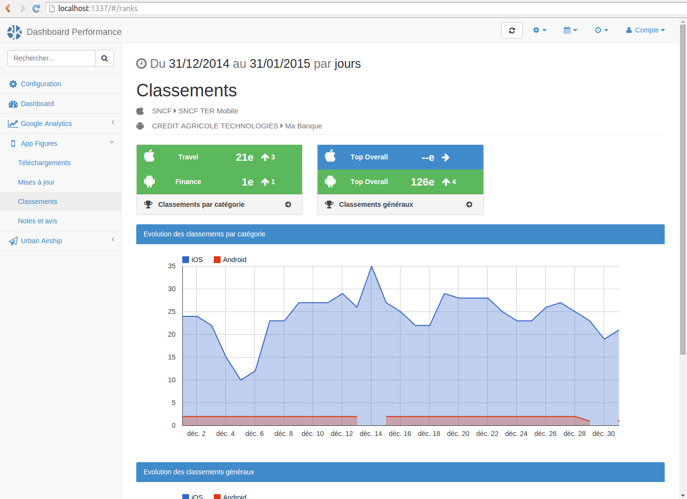
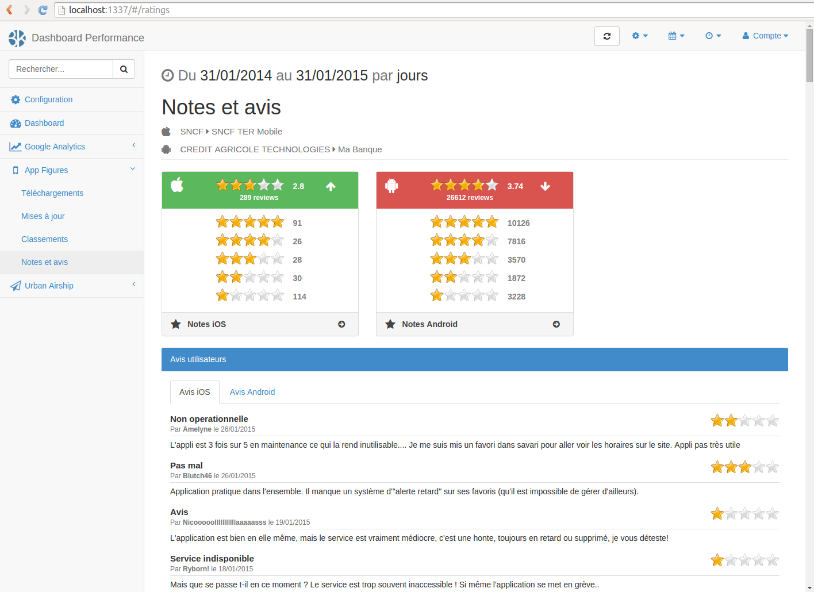
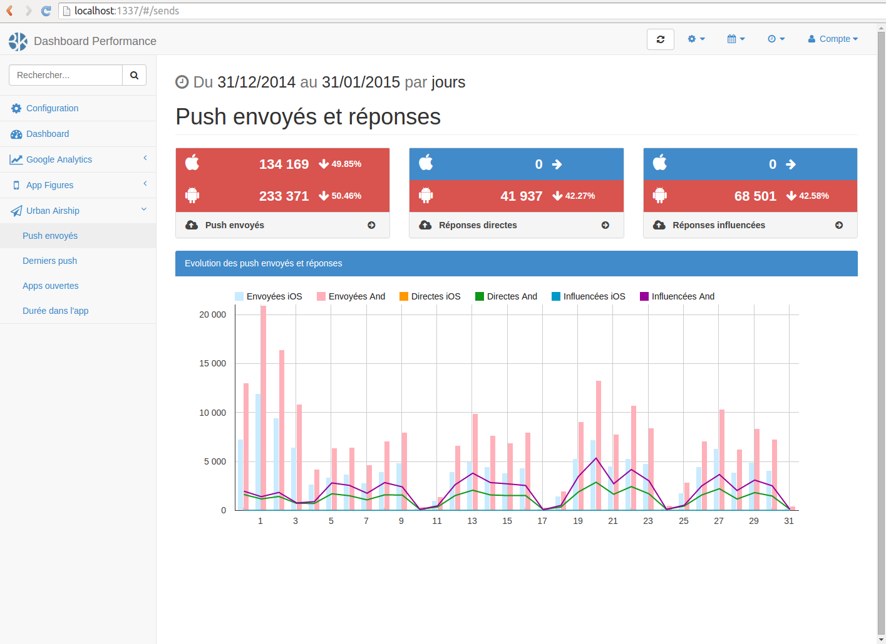
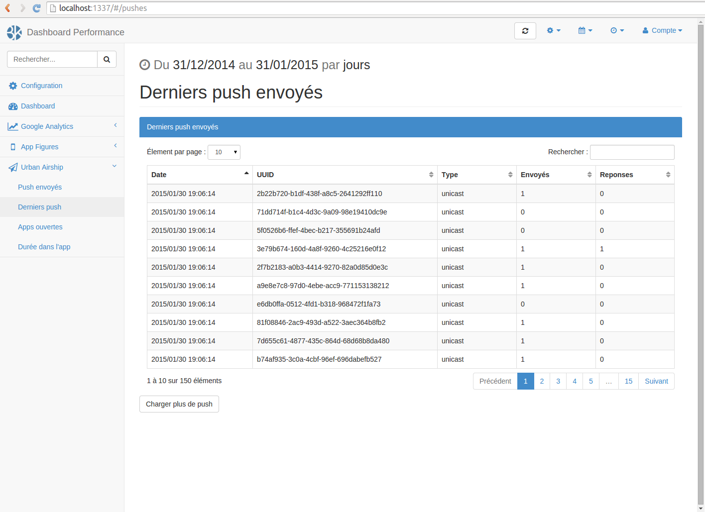

# Dashboard Performance
> KPI Dashboard / AngularJS / Node.js / Solo Project

* Full stack development (Conception, design, development, testing)
* Node.js, AngularJS, Bootstrap, MySQL, Web technologies
* Google Analytics API, Google Charts, AppFigures API, Urban Airship API, Facebook API
* Solo Project
* Analysis of the projects needs
* Estimates of the development charge

Implementation of a Performance Dashboard, an interface to monitor clients services (web and mobile) KPI (keys performance indicators), defined at the beginning of the project or as part of a performance offer.  
Working alone on the project, I dealed with a full-stack development, from the conception to the realisation.

### Screenshots

